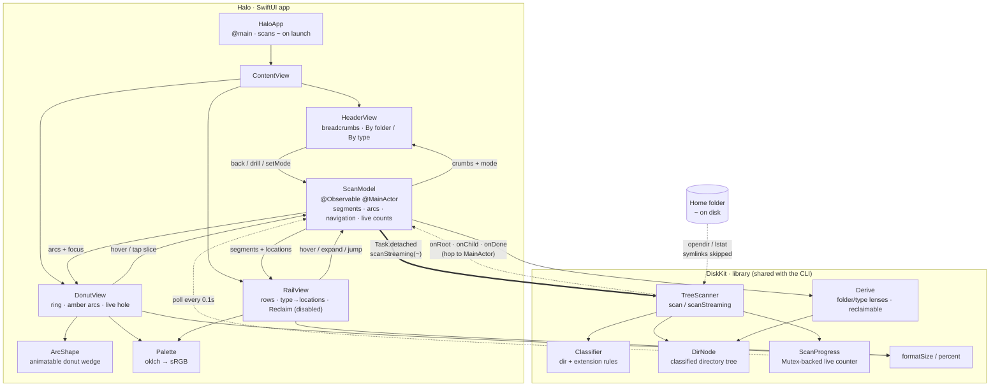
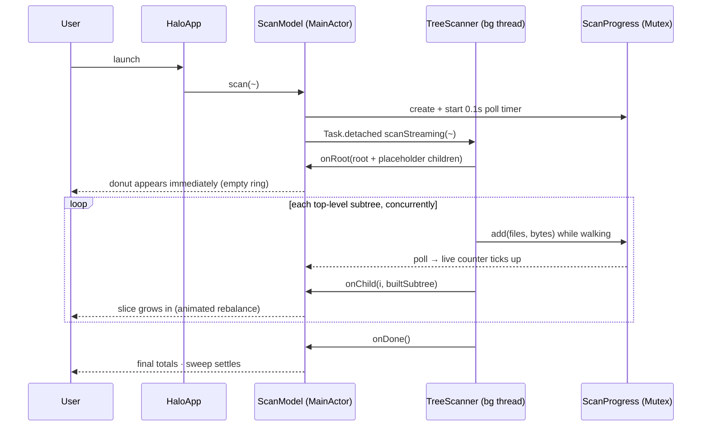

# Halo — architecture

A native SwiftUI re-implementation of the `Dial.html` design: a clean light
donut disk visualizer built on the project's POSIX scanner. It scans a real
directory tree, classifies it, and renders an interactive donut with two lenses
(**by folder** and **by type**) plus a synced sidebar.

## Components & data flow

## Streaming scan sequence

A full home-folder walk takes a long time (a large `~` is minutes), so the UI
never waits for completion — it renders immediately and fills in as top-level
subtrees finish, with a live counter throughout.

## Key decisions

- **Donut by `Canvas`/`Shape`, not Swift Charts** — Charts can't draw the
  per-slice amber *reclaimable* overhang; `ArcShape` reproduces the design's
  exact arc geometry and animates the sweep + hover lift.
- **Directory-only tree** — files are aggregated per directory by category
  (`DirNode.fileBytes`) rather than one node per file, so a whole-home scan
  stays tractable in memory.
- **Override categories** — a reclaimable directory (`node_modules`, `Caches`,
  `DerivedData`, `.Trash`) attributes its whole subtree to its category, so the
  *by type* lens answers "where is all my X?" correctly.
- **Visualize-only** — reclaimable space is shown (amber arcs, "free" tags), but
  the Reclaim button is intentionally disabled; nothing is deleted.
- **Real macOS window chrome** — the design's mock traffic-light titlebar is the
  real window; the app uses a hidden title bar.
